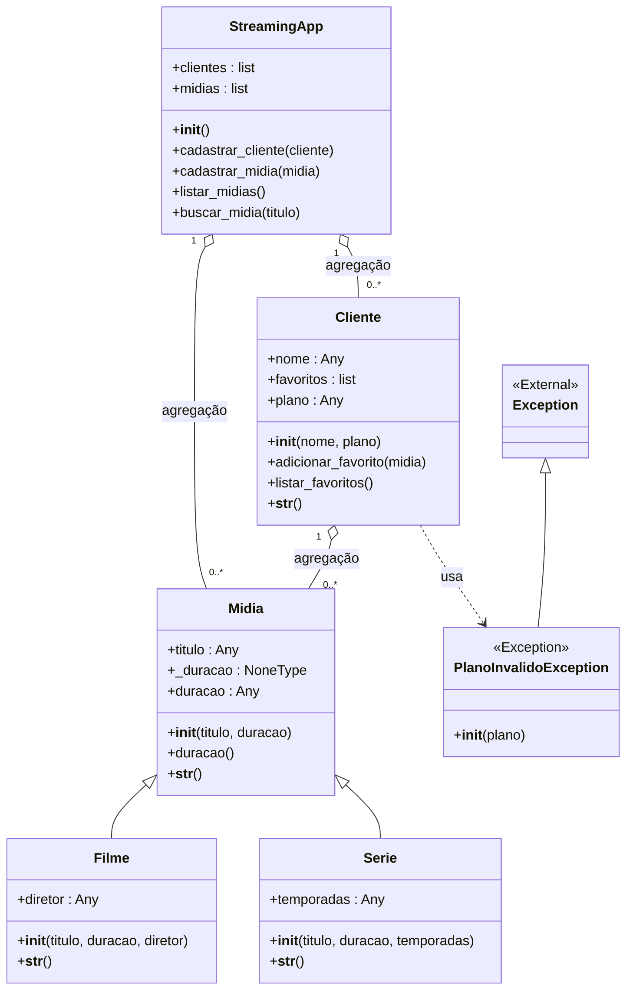
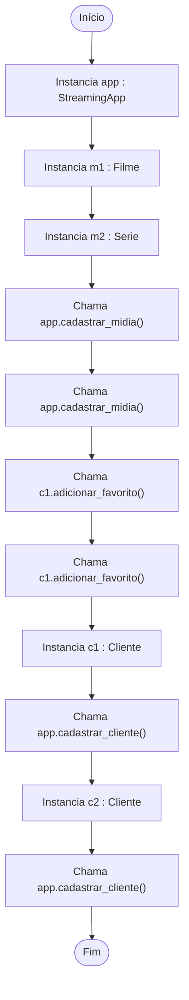

# 🚀 AutoDocUML

**Geração Automática de Documentação e Diagramas UML para Projetos Python.**

O **AutoDocUML** é uma ferramenta de linha de comando (CLI) que analisa o código-fonte de projetos Python (usando Árvores de Sintaxe Abstrata - AST) e gera automaticamente documentação em Markdown. Ele mapeia relacionamentos complexos de Orientação a Objetos e cria diagramas visuais interativos utilizando **Mermaid.js**.

Perfeito para documentar portfólios, agilizar o *onboarding* de novos desenvolvedores ou simplesmente entender a arquitetura de projetos legados.

---

## ✨ Funcionalidades

- 🧠 **Análise Estática Inteligente (AST):** Lê o código sem precisar executá-lo, garantindo segurança e rapidez.
- 🏗️ **Diagrama de Classes Unificado:** Detecta automaticamente Herança, Composição, Agregação e Dependência entre as classes.
- 🛤️ **Mapeamento de Fluxo (Main Flow):** Rastreia as chamadas de métodos e instanciação de objetos a partir de um arquivo principal.
- 🔗 **Links Dinâmicos:** Gera índices de navegação clicáveis que apontam para as linhas exatas do código no **VS Code** (uso local) ou no **GitHub** (uso web/portfólio).

---

## 📊 Exemplo Prático (Showcase)

Para demonstrar o poder do AutoDocUML, rodamos a ferramenta em um **Sistema de Streaming** construído em Python. Veja o que ele é capaz de gerar automaticamente apenas lendo o código:

### 1. Diagrama de Classes Gerado
O script entende perfeitamente que `Filme` e `Serie` herdam de `Midia`, e que o `StreamingApp` agrega `Clientes` e `Midias`.



### 2. Fluxo de Execução (Entry Point)
Ele também mapeia o que acontece quando o script é executado, passo a passo:



---

## 🚀 Como Instalar e Usar

**Pré-requisitos:** Python 3.6 ou superior (usa apenas bibliotecas nativas, sem necessidade de `pip install`).

### 1. Clone o repositório:

```bash
git clone [https://github.com/FrantzJupiter/AutoDocUML.git](https://github.com/FrantzJupiter/AutoDocUML.git)
cd AutoDocUML
```

### 2. Uso Local (Links para o VS Code):
Gera um `.md` onde os links abrem os arquivos diretamente no seu editor.

```bash
python AutoDoc.py caminho/para/seu_arquivo_principal.py
```

### 3. Uso para Portfólio (Links para o GitHub):
Utilize a flag `--web` para gerar links relativos que funcionam nativamente no visualizador do GitHub. Você também pode especificar o repositório alvo com `--repo`.

```bash
python AutoDoc.py caminho/para/seu_arquivo_principal.py --web --repo [https://github.com/SeuUsuario/SeuRepo](https://github.com/SeuUsuario/SeuRepo)
```

---

## 👨‍💻 Desenvolvedor
Projeto criado e mantido por:
- [Luis Frantz Granado Junior](https://github.com/FrantzJupiter)

Sinta-se livre para abrir *Issues* ou enviar *Pull Requests*!