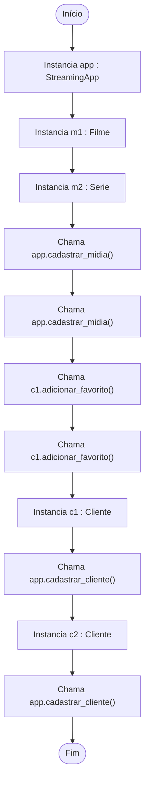
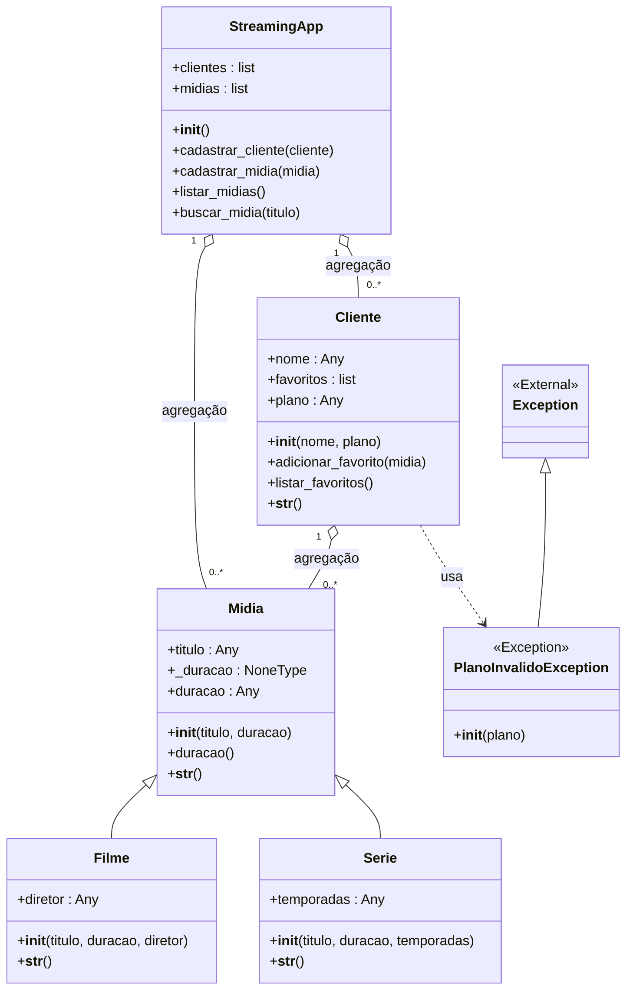

# 📘 Documentação: main.py
> Gerado automaticamente via AutoDoc.py - Criado por [FrantzJupiter](https://github.com/FrantzJupiter/AutoDocUML)

## 🚀 Fluxo de Execução (Main)

## 🏗️ Diagrama de Classes Unificado

## 📍 Índice de Navegação

### 📂 `app.py`
- 🟡 **[StreamingApp](vscode://file/C%3A/Users/luisf/Desktop/Frantz/Estudos/Script%20Auto%20Documentacao%20UML/AutoDocUML/exemplo/models/app.py:1)** (Linha 1)
  - **Atributos:**
    - 🔹 [clientes](vscode://file/C%3A/Users/luisf/Desktop/Frantz/Estudos/Script%20Auto%20Documentacao%20UML/AutoDocUML/exemplo/models/app.py:3) : `list`
    - 🔹 [midias](vscode://file/C%3A/Users/luisf/Desktop/Frantz/Estudos/Script%20Auto%20Documentacao%20UML/AutoDocUML/exemplo/models/app.py:4) : `list`
  - **Métodos:**
    - 🔸 [__init__()](vscode://file/C%3A/Users/luisf/Desktop/Frantz/Estudos/Script%20Auto%20Documentacao%20UML/AutoDocUML/exemplo/models/app.py:2)
    - 🔸 [cadastrar_cliente()](vscode://file/C%3A/Users/luisf/Desktop/Frantz/Estudos/Script%20Auto%20Documentacao%20UML/AutoDocUML/exemplo/models/app.py:6)
    - 🔸 [cadastrar_midia()](vscode://file/C%3A/Users/luisf/Desktop/Frantz/Estudos/Script%20Auto%20Documentacao%20UML/AutoDocUML/exemplo/models/app.py:9)
    - 🔸 [listar_midias()](vscode://file/C%3A/Users/luisf/Desktop/Frantz/Estudos/Script%20Auto%20Documentacao%20UML/AutoDocUML/exemplo/models/app.py:12)
    - 🔸 [buscar_midia()](vscode://file/C%3A/Users/luisf/Desktop/Frantz/Estudos/Script%20Auto%20Documentacao%20UML/AutoDocUML/exemplo/models/app.py:15)

### 📂 `cliente.py`
- 🟡 **[Cliente](vscode://file/C%3A/Users/luisf/Desktop/Frantz/Estudos/Script%20Auto%20Documentacao%20UML/AutoDocUML/exemplo/models/cliente.py:3)** (Linha 3)
  - **Atributos:**
    - 🔹 [nome](vscode://file/C%3A/Users/luisf/Desktop/Frantz/Estudos/Script%20Auto%20Documentacao%20UML/AutoDocUML/exemplo/models/cliente.py:5) : `Any`
    - 🔹 [favoritos](vscode://file/C%3A/Users/luisf/Desktop/Frantz/Estudos/Script%20Auto%20Documentacao%20UML/AutoDocUML/exemplo/models/cliente.py:6) : `list`
    - 🔹 [plano](vscode://file/C%3A/Users/luisf/Desktop/Frantz/Estudos/Script%20Auto%20Documentacao%20UML/AutoDocUML/exemplo/models/cliente.py:7) : `Any`
  - **Métodos:**
    - 🔸 [__init__()](vscode://file/C%3A/Users/luisf/Desktop/Frantz/Estudos/Script%20Auto%20Documentacao%20UML/AutoDocUML/exemplo/models/cliente.py:4)
    - 🔸 [adicionar_favorito()](vscode://file/C%3A/Users/luisf/Desktop/Frantz/Estudos/Script%20Auto%20Documentacao%20UML/AutoDocUML/exemplo/models/cliente.py:12)
    - 🔸 [listar_favoritos()](vscode://file/C%3A/Users/luisf/Desktop/Frantz/Estudos/Script%20Auto%20Documentacao%20UML/AutoDocUML/exemplo/models/cliente.py:15)
    - 🔸 [__str__()](vscode://file/C%3A/Users/luisf/Desktop/Frantz/Estudos/Script%20Auto%20Documentacao%20UML/AutoDocUML/exemplo/models/cliente.py:20)

### 📂 `excecoes.py`
- 🟡 **[PlanoInvalidoException](vscode://file/C%3A/Users/luisf/Desktop/Frantz/Estudos/Script%20Auto%20Documentacao%20UML/AutoDocUML/exemplo/models/excecoes.py:1)** (Linha 1)
  - **Métodos:**
    - 🔸 [__init__()](vscode://file/C%3A/Users/luisf/Desktop/Frantz/Estudos/Script%20Auto%20Documentacao%20UML/AutoDocUML/exemplo/models/excecoes.py:2)

### 📂 `filme.py`
- 🟡 **[Filme](vscode://file/C%3A/Users/luisf/Desktop/Frantz/Estudos/Script%20Auto%20Documentacao%20UML/AutoDocUML/exemplo/models/filme.py:3)** (Linha 3)
  - **Atributos:**
    - 🔹 [diretor](vscode://file/C%3A/Users/luisf/Desktop/Frantz/Estudos/Script%20Auto%20Documentacao%20UML/AutoDocUML/exemplo/models/filme.py:6) : `Any`
  - **Métodos:**
    - 🔸 [__init__()](vscode://file/C%3A/Users/luisf/Desktop/Frantz/Estudos/Script%20Auto%20Documentacao%20UML/AutoDocUML/exemplo/models/filme.py:4)
    - 🔸 [__str__()](vscode://file/C%3A/Users/luisf/Desktop/Frantz/Estudos/Script%20Auto%20Documentacao%20UML/AutoDocUML/exemplo/models/filme.py:8)

### 📂 `midia.py`
- 🟡 **[Midia](vscode://file/C%3A/Users/luisf/Desktop/Frantz/Estudos/Script%20Auto%20Documentacao%20UML/AutoDocUML/exemplo/models/midia.py:1)** (Linha 1)
  - **Atributos:**
    - 🔹 [titulo](vscode://file/C%3A/Users/luisf/Desktop/Frantz/Estudos/Script%20Auto%20Documentacao%20UML/AutoDocUML/exemplo/models/midia.py:3) : `Any`
    - 🔹 [_duracao](vscode://file/C%3A/Users/luisf/Desktop/Frantz/Estudos/Script%20Auto%20Documentacao%20UML/AutoDocUML/exemplo/models/midia.py:4) : `NoneType`
    - 🔹 [duracao](vscode://file/C%3A/Users/luisf/Desktop/Frantz/Estudos/Script%20Auto%20Documentacao%20UML/AutoDocUML/exemplo/models/midia.py:5) : `Any`
  - **Métodos:**
    - 🔸 [__init__()](vscode://file/C%3A/Users/luisf/Desktop/Frantz/Estudos/Script%20Auto%20Documentacao%20UML/AutoDocUML/exemplo/models/midia.py:2)
    - 🔸 [duracao()](vscode://file/C%3A/Users/luisf/Desktop/Frantz/Estudos/Script%20Auto%20Documentacao%20UML/AutoDocUML/exemplo/models/midia.py:8)
    - 🔸 [__str__()](vscode://file/C%3A/Users/luisf/Desktop/Frantz/Estudos/Script%20Auto%20Documentacao%20UML/AutoDocUML/exemplo/models/midia.py:17)

### 📂 `serie.py`
- 🟡 **[Serie](vscode://file/C%3A/Users/luisf/Desktop/Frantz/Estudos/Script%20Auto%20Documentacao%20UML/AutoDocUML/exemplo/models/serie.py:4)** (Linha 4)
  - **Atributos:**
    - 🔹 [temporadas](vscode://file/C%3A/Users/luisf/Desktop/Frantz/Estudos/Script%20Auto%20Documentacao%20UML/AutoDocUML/exemplo/models/serie.py:7) : `Any`
  - **Métodos:**
    - 🔸 [__init__()](vscode://file/C%3A/Users/luisf/Desktop/Frantz/Estudos/Script%20Auto%20Documentacao%20UML/AutoDocUML/exemplo/models/serie.py:5)
    - 🔸 [__str__()](vscode://file/C%3A/Users/luisf/Desktop/Frantz/Estudos/Script%20Auto%20Documentacao%20UML/AutoDocUML/exemplo/models/serie.py:9)