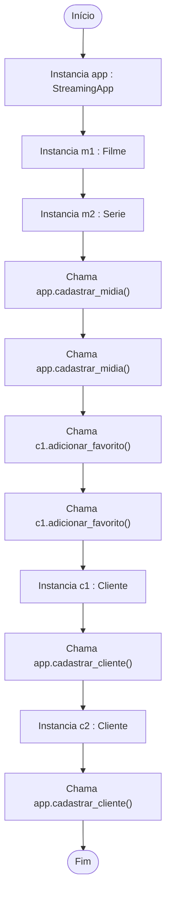
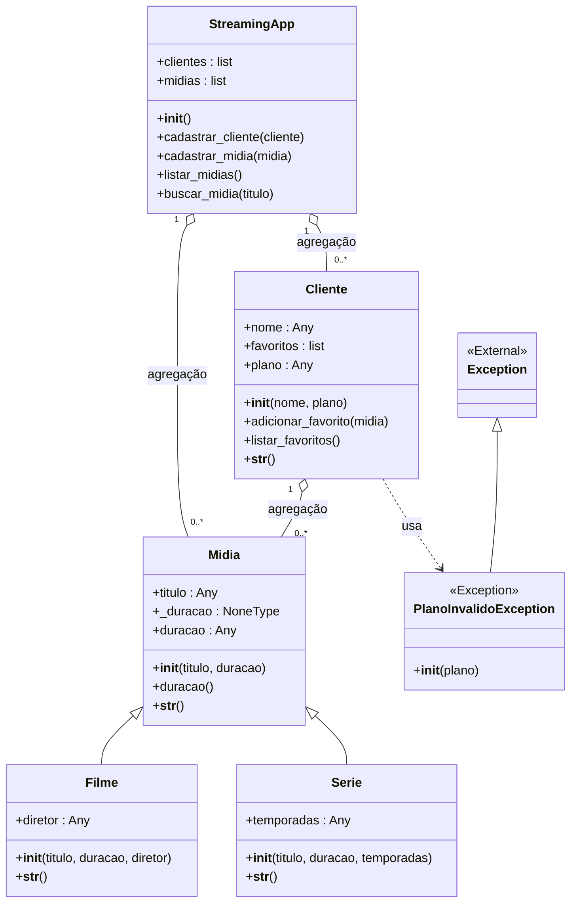

# Documentação: main.py
> Gerado automaticamente via AutoDoc.py - Criado por [FrantzJupiter](https://github.com/FrantzJupiter/AutoDocUML). Este markdown foi gerado baseado no código de exemplo. Para testar, rode o AutoDoc no arquivo main.py do sistema de exemplo.

## Fluxo de Execução (Main)

## Diagrama de Classes Unificado

## Índice de Navegação

### `app.py`
- **[StreamingApp](https://github.com/FrantzJupiter/AutoDocPythonUML/blob/main/models/app.py#L1)** (Linha 1)
  - **Atributos:**
    - [clientes](https://github.com/FrantzJupiter/AutoDocPythonUML/blob/main/models/app.py#L3) : `list`
    - [midias](https://github.com/FrantzJupiter/AutoDocPythonUML/blob/main/models/app.py#L4) : `list`
  - **Métodos:**
    - [__init__()](https://github.com/FrantzJupiter/AutoDocPythonUML/blob/main/models/app.py#L2)
    - [cadastrar_cliente()](https://github.com/FrantzJupiter/AutoDocPythonUML/blob/main/models/app.py#L6)
    - [cadastrar_midia()](https://github.com/FrantzJupiter/AutoDocPythonUML/blob/main/models/app.py#L9)
    - [listar_midias()](https://github.com/FrantzJupiter/AutoDocPythonUML/blob/main/models/app.py#L12)
    - [buscar_midia()](https://github.com/FrantzJupiter/AutoDocPythonUML/blob/main/models/app.py#L15)

### `cliente.py`
- **[Cliente](https://github.com/FrantzJupiter/AutoDocPythonUML/blob/main/models/cliente.py#L3)** (Linha 3)
  - **Atributos:**
    - [nome](https://github.com/FrantzJupiter/AutoDocPythonUML/blob/main/models/cliente.py#L5) : `Any`
    - [favoritos](https://github.com/FrantzJupiter/AutoDocPythonUML/blob/main/models/cliente.py#L6) : `list`
    - [plano](https://github.com/FrantzJupiter/AutoDocPythonUML/blob/main/models/cliente.py#L7) : `Any`
  - **Métodos:**
    - [__init__()](https://github.com/FrantzJupiter/AutoDocPythonUML/blob/main/models/cliente.py#L4)
    - [adicionar_favorito()](https://github.com/FrantzJupiter/AutoDocPythonUML/blob/main/models/cliente.py#L12)
    - [listar_favoritos()](https://github.com/FrantzJupiter/AutoDocPythonUML/blob/main/models/cliente.py#L15)
    - [__str__()](https://github.com/FrantzJupiter/AutoDocPythonUML/blob/main/models/cliente.py#L20)

### `excecoes.py`
- **[PlanoInvalidoException](https://github.com/FrantzJupiter/AutoDocPythonUML/blob/main/models/excecoes.py#L1)** (Linha 1)
  - **Métodos:**
    - [__init__()](https://github.com/FrantzJupiter/AutoDocPythonUML/blob/main/models/excecoes.py#L2)

### `filme.py`
- **[Filme](https://github.com/FrantzJupiter/AutoDocPythonUML/blob/main/models/filme.py#L3)** (Linha 3)
  - **Atributos:**
    - [diretor](https://github.com/FrantzJupiter/AutoDocPythonUML/blob/main/models/filme.py#L6) : `Any`
  - **Métodos:**
    - [__init__()](https://github.com/FrantzJupiter/AutoDocPythonUML/blob/main/models/filme.py#L4)
    - [__str__()](https://github.com/FrantzJupiter/AutoDocPythonUML/blob/main/models/filme.py#L8)

### `midia.py`
- **[Midia](https://github.com/FrantzJupiter/AutoDocPythonUML/blob/main/models/midia.py#L1)** (Linha 1)
  - **Atributos:**
    - [titulo](https://github.com/FrantzJupiter/AutoDocPythonUML/blob/main/models/midia.py#L3) : `Any`
    - [_duracao](https://github.com/FrantzJupiter/AutoDocPythonUML/blob/main/models/midia.py#L4) : `NoneType`
    - [duracao](https://github.com/FrantzJupiter/AutoDocPythonUML/blob/main/models/midia.py#L5) : `Any`
  - **Métodos:**
    - [__init__()](https://github.com/FrantzJupiter/AutoDocPythonUML/blob/main/models/midia.py#L2)
    - [duracao()](https://github.com/FrantzJupiter/AutoDocPythonUML/blob/main/models/midia.py#L8)
    - [__str__()](https://github.com/FrantzJupiter/AutoDocPythonUML/blob/main/models/midia.py#L17)

### `serie.py`
- **[Serie](https://github.com/FrantzJupiter/AutoDocPythonUML/blob/main/models/serie.py#L4)** (Linha 4)
  - **Atributos:**
    - [temporadas](https://github.com/FrantzJupiter/AutoDocPythonUML/blob/main/models/serie.py#L7) : `Any`
  - **Métodos:**
    - [__init__()](https://github.com/FrantzJupiter/AutoDocPythonUML/blob/main/models/serie.py#L5)
    - [__str__()](https://github.com/FrantzJupiter/AutoDocPythonUML/blob/main/models/serie.py#L9)
