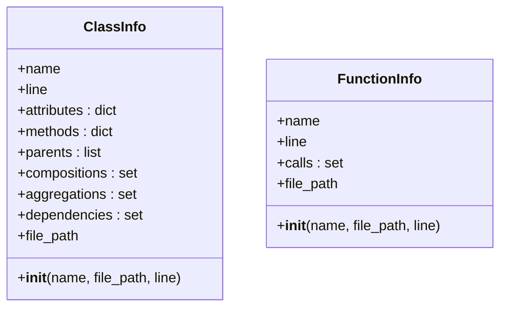
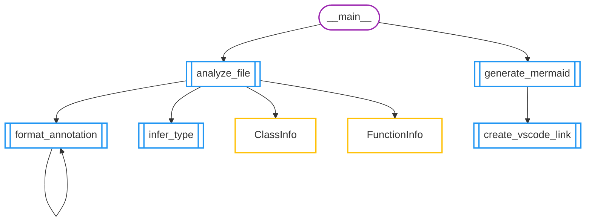

# Auto-Documentação: generate_uml.py
> Arquivo analisado: `generate_uml.py`

## 🏗️ Estrutura de Classes

## 🚀 Fluxo de Execução

## 📍 Índice de Navegação
### Classes
- 🟡 **[ClassInfo](vscode://file/C%3A/Users/luisf/Desktop/Frantz/Estudos/Uniacademia/Orienta%C3%A7%C3%A3o%20a%20objetos/excecoes_poo/generate_uml.py:42)** (Linha 42)
- 🟡 **[FunctionInfo](vscode://file/C%3A/Users/luisf/Desktop/Frantz/Estudos/Uniacademia/Orienta%C3%A7%C3%A3o%20a%20objetos/excecoes_poo/generate_uml.py:54)** (Linha 54)

### Funções
- 🔵 **[analyze_file](vscode://file/C%3A/Users/luisf/Desktop/Frantz/Estudos/Uniacademia/Orienta%C3%A7%C3%A3o%20a%20objetos/excecoes_poo/generate_uml.py:62)** (Linha 62)
- 🔵 **[create_vscode_link](vscode://file/C%3A/Users/luisf/Desktop/Frantz/Estudos/Uniacademia/Orienta%C3%A7%C3%A3o%20a%20objetos/excecoes_poo/generate_uml.py:207)** (Linha 207)
- 🔵 **[format_annotation](vscode://file/C%3A/Users/luisf/Desktop/Frantz/Estudos/Uniacademia/Orienta%C3%A7%C3%A3o%20a%20objetos/excecoes_poo/generate_uml.py:9)** (Linha 9)
- 🔵 **[generate_mermaid](vscode://file/C%3A/Users/luisf/Desktop/Frantz/Estudos/Uniacademia/Orienta%C3%A7%C3%A3o%20a%20objetos/excecoes_poo/generate_uml.py:219)** (Linha 219)
- 🔵 **[infer_type](vscode://file/C%3A/Users/luisf/Desktop/Frantz/Estudos/Uniacademia/Orienta%C3%A7%C3%A3o%20a%20objetos/excecoes_poo/generate_uml.py:29)** (Linha 29)