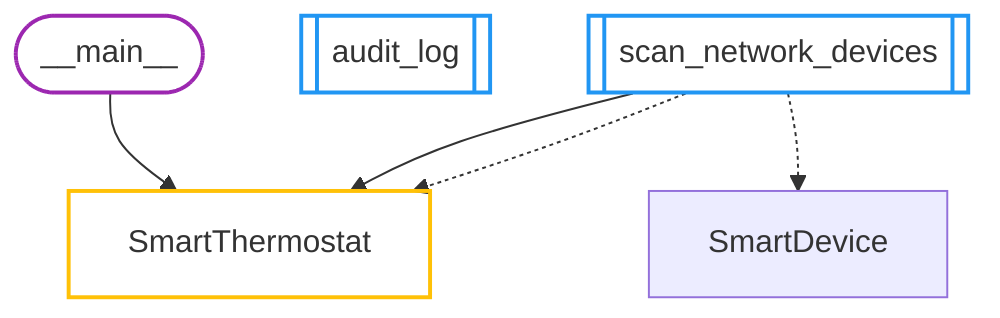
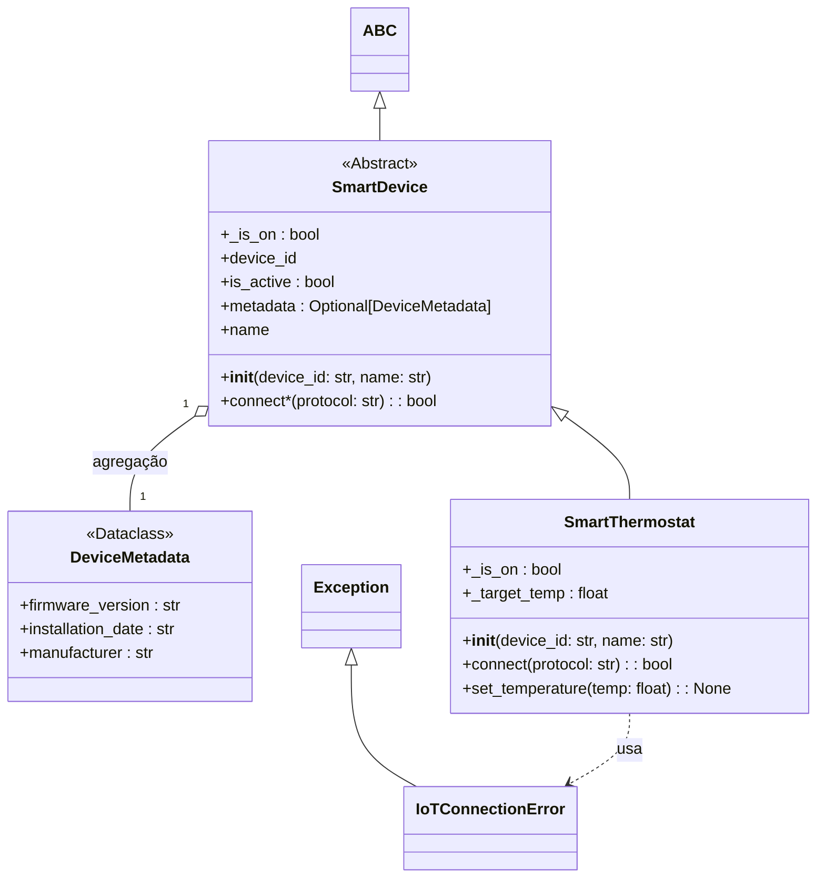

# Auto-Documentação: teste01.py
> Arquivo analisado: `teste01.py`

## 🚀 Fluxo de Execução Global

## 🏗️ Estrutura de Classes (Por Contexto)
### Contexto: SmartDevice

#### 📍 Navegação Detalhada
- 🟡 **[DeviceMetadata](vscode://file/C%3A/Users/luisf/Desktop/Frantz/Estudos/Uniacademia/Orienta%C3%A7%C3%A3o%20a%20objetos/excecoes_poo/teste01.py:9)** (Linha 9)
  - 🔹 [firmware_version](vscode://file/C%3A/Users/luisf/Desktop/Frantz/Estudos/Uniacademia/Orienta%C3%A7%C3%A3o%20a%20objetos/excecoes_poo/teste01.py:11) `(str)`
  - 🔹 [installation_date](vscode://file/C%3A/Users/luisf/Desktop/Frantz/Estudos/Uniacademia/Orienta%C3%A7%C3%A3o%20a%20objetos/excecoes_poo/teste01.py:12) `(str)`
  - 🔹 [manufacturer](vscode://file/C%3A/Users/luisf/Desktop/Frantz/Estudos/Uniacademia/Orienta%C3%A7%C3%A3o%20a%20objetos/excecoes_poo/teste01.py:10) `(str)`
- 🟡 **[IoTConnectionError](vscode://file/C%3A/Users/luisf/Desktop/Frantz/Estudos/Uniacademia/Orienta%C3%A7%C3%A3o%20a%20objetos/excecoes_poo/teste01.py:14)** (Linha 14)
- 🟡 **[SmartDevice](vscode://file/C%3A/Users/luisf/Desktop/Frantz/Estudos/Uniacademia/Orienta%C3%A7%C3%A3o%20a%20objetos/excecoes_poo/teste01.py:26)** (Linha 26)
  - 🔹 [_is_on](vscode://file/C%3A/Users/luisf/Desktop/Frantz/Estudos/Uniacademia/Orienta%C3%A7%C3%A3o%20a%20objetos/excecoes_poo/teste01.py:30) `(bool)`
  - 🔹 [device_id](vscode://file/C%3A/Users/luisf/Desktop/Frantz/Estudos/Uniacademia/Orienta%C3%A7%C3%A3o%20a%20objetos/excecoes_poo/teste01.py:28)
  - 🔹 [is_active](vscode://file/C%3A/Users/luisf/Desktop/Frantz/Estudos/Uniacademia/Orienta%C3%A7%C3%A3o%20a%20objetos/excecoes_poo/teste01.py:34) `(bool)`
  - 🔹 [metadata](vscode://file/C%3A/Users/luisf/Desktop/Frantz/Estudos/Uniacademia/Orienta%C3%A7%C3%A3o%20a%20objetos/excecoes_poo/teste01.py:31) `(Optional[DeviceMetadata])`
  - 🔹 [name](vscode://file/C%3A/Users/luisf/Desktop/Frantz/Estudos/Uniacademia/Orienta%C3%A7%C3%A3o%20a%20objetos/excecoes_poo/teste01.py:29)
  - 🔸 [__init__()](vscode://file/C%3A/Users/luisf/Desktop/Frantz/Estudos/Uniacademia/Orienta%C3%A7%C3%A3o%20a%20objetos/excecoes_poo/teste01.py:27)
  - 🔸 [connect*()](vscode://file/C%3A/Users/luisf/Desktop/Frantz/Estudos/Uniacademia/Orienta%C3%A7%C3%A3o%20a%20objetos/excecoes_poo/teste01.py:38)
- 🟡 **[SmartThermostat](vscode://file/C%3A/Users/luisf/Desktop/Frantz/Estudos/Uniacademia/Orienta%C3%A7%C3%A3o%20a%20objetos/excecoes_poo/teste01.py:41)** (Linha 41)
  - 🔹 [_is_on](vscode://file/C%3A/Users/luisf/Desktop/Frantz/Estudos/Uniacademia/Orienta%C3%A7%C3%A3o%20a%20objetos/excecoes_poo/teste01.py:53) `(bool)`
  - 🔹 [_target_temp](vscode://file/C%3A/Users/luisf/Desktop/Frantz/Estudos/Uniacademia/Orienta%C3%A7%C3%A3o%20a%20objetos/excecoes_poo/teste01.py:47) `(float)`
  - 🔸 [__init__()](vscode://file/C%3A/Users/luisf/Desktop/Frantz/Estudos/Uniacademia/Orienta%C3%A7%C3%A3o%20a%20objetos/excecoes_poo/teste01.py:45)
  - 🔸 [connect()](vscode://file/C%3A/Users/luisf/Desktop/Frantz/Estudos/Uniacademia/Orienta%C3%A7%C3%A3o%20a%20objetos/excecoes_poo/teste01.py:50)
  - 🔸 [set_temperature()](vscode://file/C%3A/Users/luisf/Desktop/Frantz/Estudos/Uniacademia/Orienta%C3%A7%C3%A3o%20a%20objetos/excecoes_poo/teste01.py:56)

---
